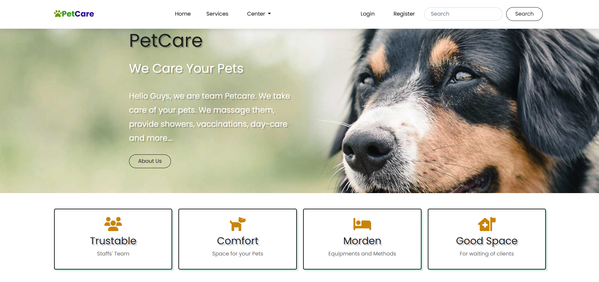
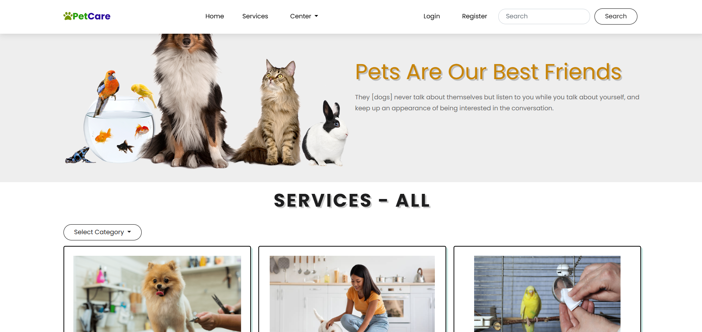

# 🐾 PetCare - Home Pet Service Website

A web application built with ASP.NET Core MVC that allows users to book at-home pet care services, view and book services by category, and manage accounts with admin functionalities.




## 🚀 Features

- 🐶 Browse services by categories (Mammal, Birds, Fish, etc.)
- 📝 Add, edit, delete services details (Admin)
- 🔐 Register/Login for users
- 📦 Book a home service for pets
- 👤 Manage user roles (Admin)
- 👤 Manage category (Admin)
- 👤 Manage booking (Admin)
- 🔍 Search services, Filter category
- 📷 Upload service pictures
- 🎨 Responsive and modern UI

## 🧰 Technologies Used

- ASP.NET Core MVC
- Entity Framework Core
- SQL Server LocalDB
- Bootstrap 5
- Identity for authentication & roles

## 📂 Folder Structure

- `Models/` – Data models (Service, Category, Comment, etc.)
- `ViewModels/` – View-specific models for clean data binding
- `Views/` – Razor pages grouped by controller
- `Controllers/` – Handle logic for views and data flow
- `wwwroot/` – Static files (CSS, JS, Images)
- `Data/` – EF DbContext and seed data

## 🛠 How to Run

1. **Clone the project**  
   ```bash
   git clone https://github.com/ThanhPhong2611/pet-care.git
   cd pet-care


## Contact me:
Email: hothanhphong2611@gmail.com
Number : +84899218329